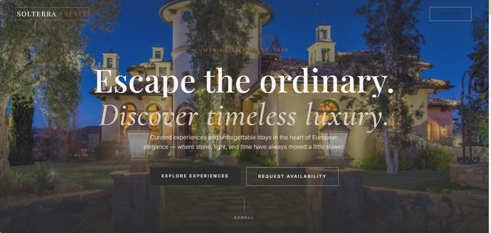
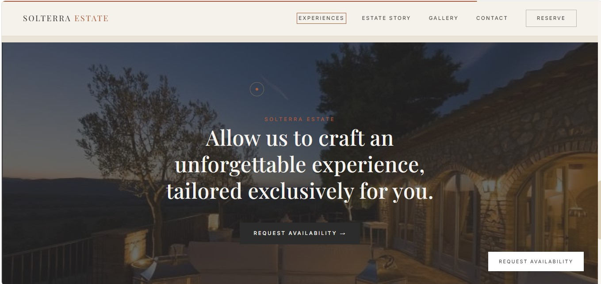
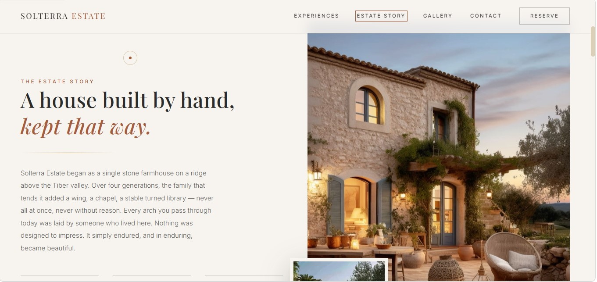
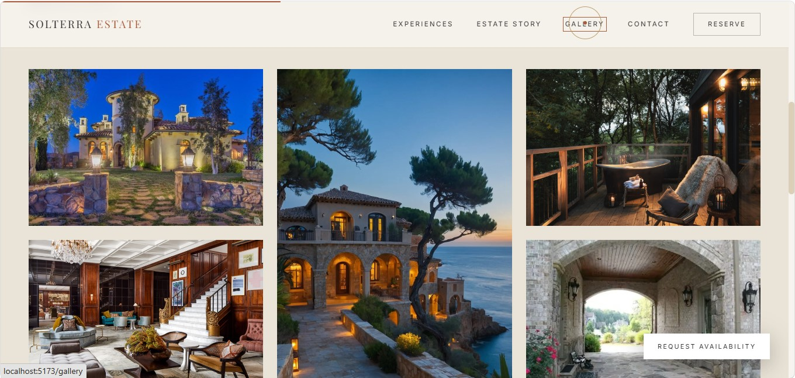
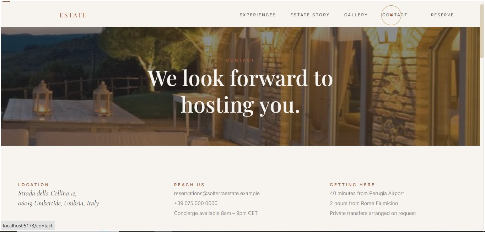
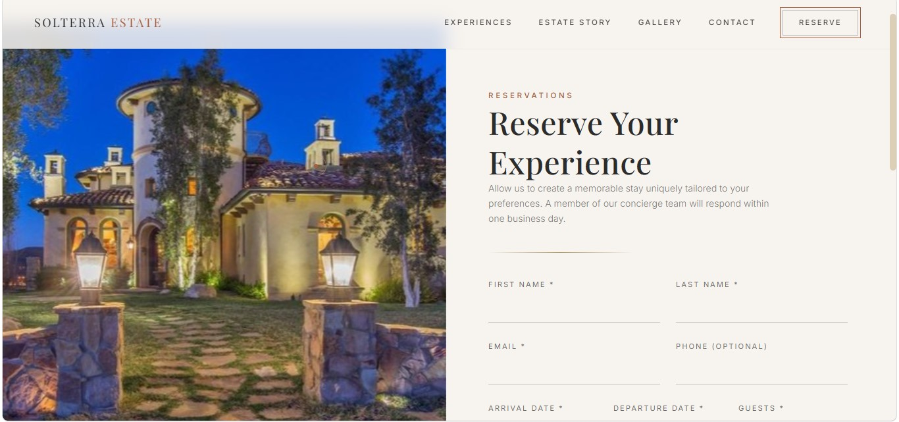
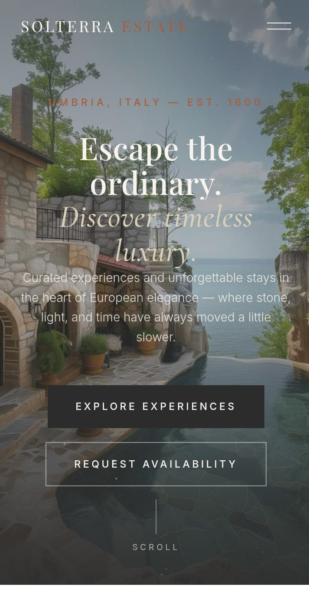

# Solterra Estate


## Ultra-Premium Luxury Hospitality & Estate Experience Website

Solterra Estate is a cinematic, high-end hospitality website inspired by European luxury estates, boutique resorts, private retreats, and premium lifestyle brands. The project focuses on elegant storytelling, immersive interactions, and modern web technologies to deliver a world-class digital experience.

---

## 🌐 Live Demo

**Website:** https://solera-estate.netlify.app/

---

## 📸 Preview

### Desktop Experience

Add screenshots here:













### Mobile Experience



---

# ✨ Features

### Premium User Experience

* Cinematic fullscreen hero section
* Luxury-inspired storytelling sections
* Smooth page transitions and animations
* Immersive scrolling experience
* Elegant typography and visual hierarchy

### Interactive Elements

* Three.js particle background
* GSAP ScrollTrigger animations
* Framer Motion page animations
* Animated gallery interactions
* Signature "Golden Hour Line" scroll effect

### Business Functionality

* Reservation inquiry form
* EmailJS integration
* Form validation using Zod
* Contact section
* Fully responsive layout

### Technical Features

* Route-level code splitting
* Lazy-loaded components
* SEO-friendly architecture
* Optimized asset loading
* Accessibility support
* Reduced-motion support

---

# 🛠 Tech Stack

### Frontend

* React 19
* TypeScript
* Vite
* Tailwind CSS

### Animation & Effects

* Framer Motion
* GSAP
* ScrollTrigger
* Lenis Smooth Scrolling
* Three.js
* React Three Fiber

### Form & Validation

* EmailJS
* Zod

### Deployment

* Netlify

---

# 🎨 Design Philosophy

Solterra Estate was designed to emulate the digital experiences of premium hospitality brands such as:

* Aman Resorts
* Four Seasons Private Retreats
* Luxury European Estates
* High-End Boutique Hotels
* Premium Lifestyle Brands

The design focuses on:

* Sophisticated visual storytelling
* Premium brand perception
* Elegant minimalism
* Cinematic interactions
* Conversion-oriented reservation flow

---

# 🎨 Design System

### Color Palette

* Ivory
* Champagne
* Warm Beige
* Muted Sage
* Soft Charcoal
* Burnt Terracotta Accent
* Soft Gold Highlights

### Typography

* Playfair Display
* Cormorant Garamond
* Inter

### Signature Element

The **Golden Hour Line** is a thin animated gold accent that draws itself across sections during scrolling, inspired by sunset horizons and luxury estate aesthetics.

---

# 📂 Project Structure

```text
src/
│
├── assets/
│   ├── images/
│   └── icons/
│
├── components/
│   ├── Navbar
│   ├── Hero
│   ├── Gallery
│   ├── Experiences
│   ├── Footer
│   └── Shared Components
│
├── hooks/
│   └── useLenis
│
├── lib/
│   └── Reservation Validation Schema
│
├── pages/
│   ├── Home
│   ├── Story
│   ├── Experiences
│   ├── Gallery
│   ├── Reservations
│   └── Contact
│
├── routes/
├── styles/
└── utils/
```

---

# 🚀 Getting Started

## Clone Repository

```bash
git clone https://github.com/MalikUsmanAli-dev/Solterra-estate.git
cd Solterra-estate
```

## Install Dependencies

```bash
npm install
```

## Start Development Server

```bash
npm run dev
```

Open:

```text
http://localhost:5173
```

---

# 📦 Production Build

```bash
npm run build
npm run preview
```

---

# 📧 Reservation Form Setup

The reservation form works without configuration and displays success states locally.

To enable actual email delivery:

## Step 1

Create a free account at:

https://www.emailjs.com/

## Step 2

Copy:

```bash
.env.example
```

to:

```bash
.env
```

## Step 3

Add your credentials:

```env
VITE_EMAILJS_SERVICE_ID=
VITE_EMAILJS_TEMPLATE_ID=
VITE_EMAILJS_PUBLIC_KEY=
```

## Step 4

Restart the development server.

---

# ⚡ Performance Optimizations

* Route-level code splitting
* Lazy-loaded Three.js components
* Optimized asset pipeline using Vite
* Long-term asset hashing and caching
* Reduced JavaScript bundle size
* Motion accessibility support
* Optimized image delivery

---

# 📱 Responsive Design

The website is fully optimized for:

✅ Desktop
✅ Laptop
✅ Tablet
✅ Mobile Devices

---

# ♿ Accessibility

* Keyboard-friendly navigation
* Semantic HTML structure
* Reduced motion support
* Responsive typography
* Accessible form validation

---

# 🚀 Deployment

## Deploy with Netlify or Vercel

Simply connect the GitHub repository directly through the Netlify or vercel dashboard.

No additional configuration is required other than optional EmailJS environment variables.

---

# 📌 Future Enhancements

* Booking management dashboard
* Availability calendar
* Multi-language support
* CMS integration
* Blog & journal section
* Premium video backgrounds
* AI concierge assistant
* Dark and light luxury themes

---

# 👨‍💻 Author

**Usman Ali**

Full Stack Developer | React Developer | Software Engineer

GitHub: https://github.com/MAlikUsmanAli-dev

Portfolio: https://malik-usman-ali-portfolio.netlify.app/

LinkedIn: https://www.linkedin.com/in/malik-usman-ali-b9b571421

---

# 📄 License

This project is intended for portfolio, educational, and demonstration purposes.

Images used in the project belong to their respective owners and should be replaced with licensed assets before commercial usage.

---

### ⭐ If you like this project, consider giving it a star on GitHub.
